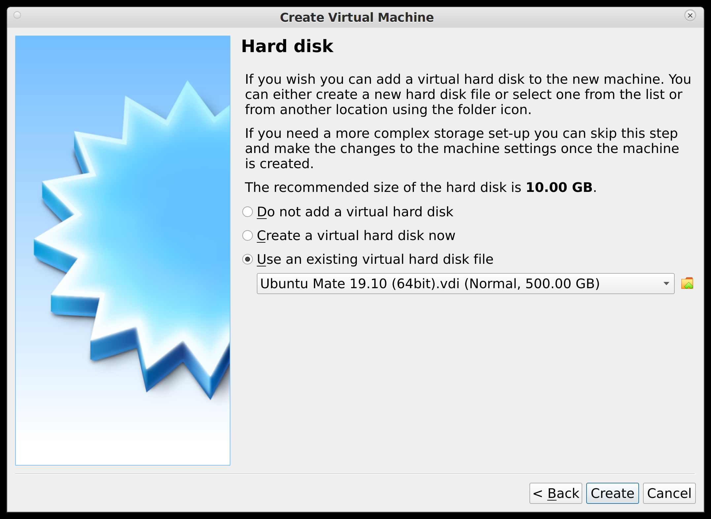
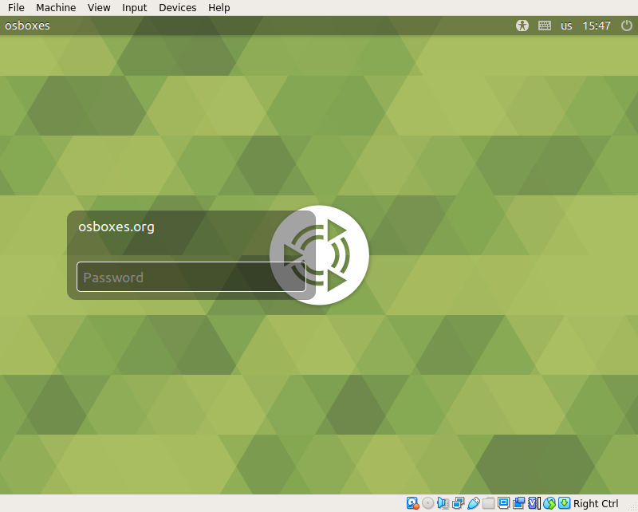
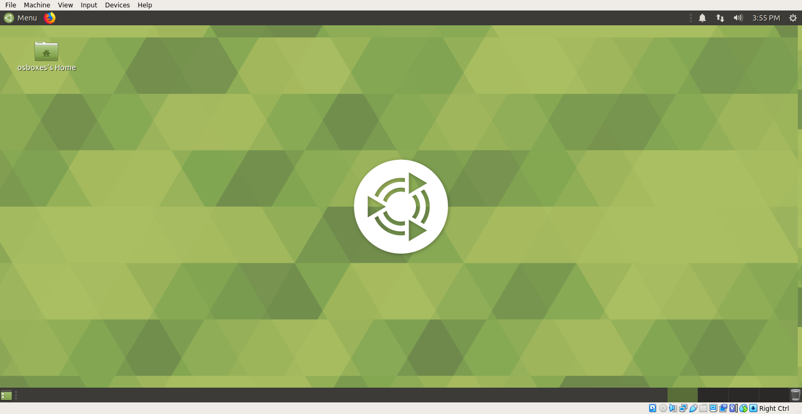

# VirtualBox Guide

It's relatively easy to install a virtual machine these days and run any number of operating systems on a single machine. This can be a relatively heavy weight solution in terms of memory requirements and disk space if you system does not have many extra resources. But most modern laptops should be be able to host a modest VM. This guide describes how to use VirtualBox to set up a Ubuntu LINUX distribution with the MATE desktop 

  * Download a LINUX VM here: https://www.osboxes.org/virtualbox-images/
    * Note: many VM images are provided here, but some variant of Ubuntu is a good choice for beginners.
    * For example, here we will use the Ubuntu-Mate image, which wil give you a desktop very similar to Rivanna.
    * Make sure you select the VirtualBox (VDI) image.
    * After downloading, extract the image from the 7z file.  Then you'll have a directory with a name like __U_M1910-VB-64bit__ containing the VDI image.  

  * Download and Install the VirtualBox [Hypervisor](https://en.wikipedia.org/wiki/Hypervisor) for your OS to manage your virtual machine.  You should reboot your machine after installing VirtualBox.

## Install the VM

Note: depending on your version of VirtualBox the options below may be presented a little differently. 

1. Open the virtualbox application and choose "New" from the menu 

2. Select a name for your VM and the OS type 

3. Choose the amount to RAM your VM will be allowed to use.  In this example we select 2GB.  If your computer has 8GB or less memory, you may need to reduce the RAM allocated (eg 1GB).  This can be changed later after the VM is installed. 

4. To create your Virtual Machine, choose "Use and existing virtual hard disk file".  The sue the file browser to select the image file (VDI file).  
And then click "Create". 

## Configure the VM

**Congratulations** you now have a virtual machine! 

Click on the setting icon to finish some configuration steps.  Note: that the settings like changing the ahrdware in you virtual computer.  Whenever you "Poweroff" you VM, you can change these settings.  Try keeping the default settings for most options. 

* Under **System** you can change the amount of RAM avaiable to your VM.  
* Under **Display** it is recommend to check the box to Enable 3D acceleration.  You can uncheck this box if you have problems with display of your VM.  There should be no need to adjust the other options.
* Go to the **Network** setting.  To enable your VM to use your existing network connection, set the Network Adapter to "Bridged Adapter".  Then if you have more than one network device (eg Wired or Wireless), choose the name of the adapter you want to use with your VM. 

_The size of your virtual disk will initally be ~7 GB.  This is disk is dynamically sized and will expand as you add files to your VM.  Unfortunately, it won't shrink automatically.  So if you cach a few seasons of your favorite Nexflix show on the VM, its disk file will get pretty large and stay that way. You can delete files and shrink the virtual disk using a combination of tools in Ubuntu and VirtualBox, but that shouldn't be necessary if you're just using your VM for class._

## Run the VM

Now exit the boot your VM Setting dialog and boot your maching by using the Start button. 
The latest login info for the osboxes VMs is available on their [FAQ page](https://www.osboxes.org/faqs/). 

A nice feature of the osboxes Ubuntu VMs is that they include the installation of the [VirtualBox Guest Additions](https://www.virtualbox.org/manual/ch04.html) which provides better integration between you computer and the VM (mouse integration, allowing dynamic resizing of the VM's desktop, etc).  

## Additional configurations

So now you've jumped into the deep end and have become a [sysadmin](https://xkcd.com/705/), congratulations/condolences* ;^)  Good luck!

* Depending on the version of Ubuntu you installed, you may be prompted to upgrade the distribution.  This is OK, if you choose to do so.
* You will probaby want to create a new user, unless you like the name *osboxes* and it's ALWAYS good practice to change the default passwords on your accounts!
* To setup the tools used in the phys56xx courses, use conda as described in the Working Environment guide.

\* Problems?  "You may do all your exercises on Rivanna instead.”  You can also take this as a challenge to pick up some new skills.  Go ahead and post your questions on our discussion group and share your discoveries as well. 
